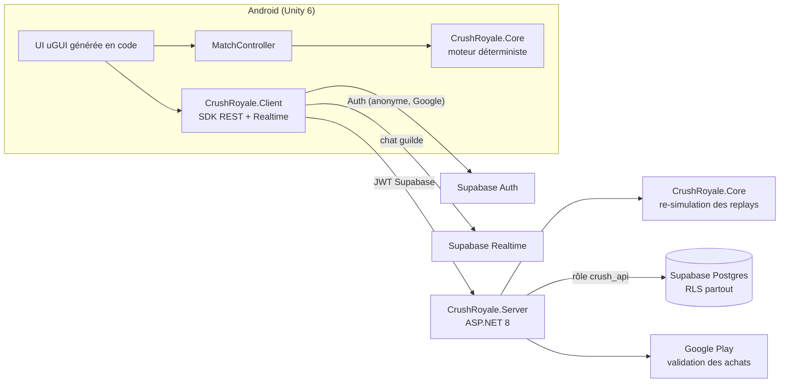

# Crush Royale

Jeu mobile Android match-3 PvP : 1000 niveaux d'histoire dans le royaume de Crystalheim, PvP en « ghost play »
(les deux joueurs affrontent exactement le même plateau), trophées et ligues, 9 bonus, cascades et Red Surge,
guildes avec boss hebdomadaire et chat en temps réel, boutique, VIP, passe de combat, succès, anti-triche
côté serveur, 11 langues.

## Architecture



Le même moteur C# (`CrushRoyale.Core`) tourne sur le téléphone et sur le serveur. Chaque partie est une graine
et une liste d'actions horodatées : le serveur la rejoue et n'accepte que les scores qu'il retrouve à l'identique.
C'est le cœur de l'anti-triche et de l'équité du PvP.

## Contenu du dépôt

| Dossier | Rôle |
|---|---|
| `src/CrushRoyale.Core` | Moteur de jeu déterministe (netstandard2.1) : plateau, cascades, bonus, histoire, économie, PvP, guildes, anti-triche |
| `src/CrushRoyale.Contracts` | DTO et routes partagés client/serveur |
| `src/CrushRoyale.Server` | API ASP.NET 8, stockage Postgres ou mémoire, tâches de fond (matchmaking, saisons) |
| `src/CrushRoyale.Client` | SDK .NET utilisé par Unity : auth Supabase, API, file hors ligne, chat Realtime |
| `tests/` | 234 tests (Core, Server, Client) |
| `supabase/migrations` | Schéma SQL complet avec RLS |
| `unity/CrushRoyale` | Projet Unity : écrans, rendu du plateau, audio procédural, IAP, notifications |
| `tools/sync-unity.ps1` | Compile les DLL, exporte les données de jeu et génère les traductions vers Unity |
| `tools/LocalizationGen` | Génère et valide les 11 fichiers de langue |
| `docs/` | Décisions de conception, backend, API, guide Unity |

## Démarrage rapide

Prérequis : SDK .NET 8.

```bash
dotnet test CrushRoyale.sln
```

Serveur local sans Supabase (stockage en mémoire, authentification de test par l'en-tête `X-Dev-User`) :

```bash
dotnet run --project src/CrushRoyale.Server --environment Development
```

Projet Unity : voir [docs/UNITY.md](docs/UNITY.md). Sans Unity installé, GitHub peut compiler l'APK Android dans
le cloud ([build dans le cloud](docs/UNITY.md#build-dans-le-cloud-sans-installer-unity)). Sans backend configuré,
le jeu démarre en mode entraînement hors ligne (niveaux 1 à 50 et PvP contre un bot).

## Documentation

- [docs/DESIGN_DECISIONS.md](docs/DESIGN_DECISIONS.md) : ce qui a été ajouté ou corrigé par rapport au GDD, et pourquoi
- [docs/BACKEND.md](docs/BACKEND.md) : Supabase, configuration du serveur, Google Play, déploiement
- [docs/API.md](docs/API.md) : routes de l'API
- [docs/UNITY.md](docs/UNITY.md) : ouverture du projet, build Android, achats intégrés

## État

| Partie | État |
|---|---|
| Moteur, économie, histoire, PvP, guildes, anti-triche | Fait, testé |
| API serveur + schéma Supabase | Fait, testé (en mémoire) ; à brancher sur un vrai projet Supabase |
| SDK client | Fait, testé |
| Projet Unity | Écrit mais pas encore compilé dans Unity : prévoir quelques corrections à la première ouverture |
| Traductions | Interface complète en 11 langues ; dialogues en anglais et français (les autres langues affichent l'anglais) |
| Graphismes et sons | Générés en code (formes et sons procéduraux), à remplacer par de vrais assets |
